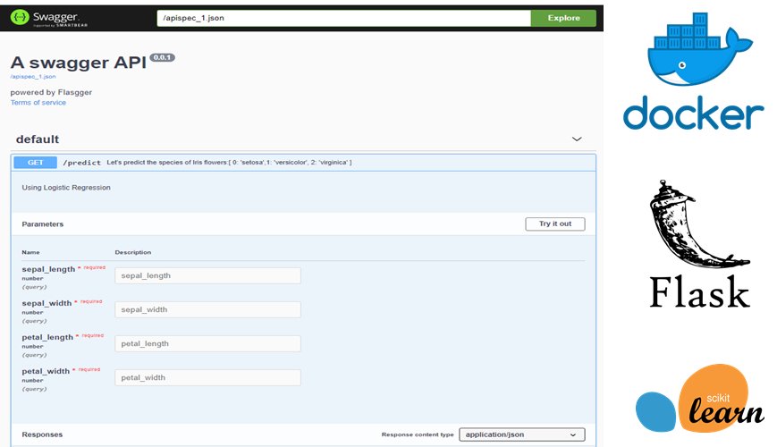

# End-to-End ML application with Flask REST API- Flasgger- Docker 🐳
This project is about a Flask web app for predicting the species of Iris flower. It is an End-to-End ML application with Flask and containerize the App with Docker. The App can be run with only Python or using Docker. Docker is an open platform for running applications in an isolated environment, allowing us to more easily develop and deploy applications. The Docker container wraps up the entire code , which makes it portable.

For Testing the endpoints I used Flassgger. Flasgger helps to create a simple Frontend for ML application. 

## Cloning the repo
git clone https://github.com/RozWhite/Iris_docker

## Run it locally 
Run: python app.py 

Test the API at <http://localhost:3000/apidocs/>

## Run with Docker

You can use the docker file from here or just download the existing image from [DockerHub](https://hub.docker.com/r/rozitadocker123/ml_flask_docker/).
```
docker pull rozitadocker123/ml_flask_docker
```

To build the Docker image :
```
docker image build -t iris_docker .
```


To run the Docker image:
```
docker run -d --name iris_model --rm -p 3000:3000 iris_docker
```
You can then test the API at <http://localhost:3000/apidocs/>  within the docker

</br>


